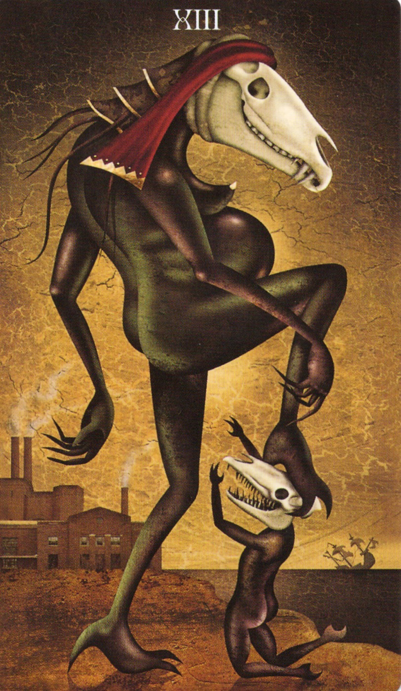

# 8大祝祭とDeviant Moon Tarotの対応表

このドキュメントは、RavensgateにおけるWheel of the Year（年の車輪）の8つの祝祭と、Deviant Moon Tarotのカードとの象徴的な対応を示す一覧です。
今後それぞれの祝祭に対応した儀式や内的ワークのプロトコルを追加していく予定です。

---

## 🌟 Ostara（春分）
- **日付**：3月19日〜23日頃
- **対応カード**：The Fool（愚者）
- **象徴テーマ**：誕生、新たな始まり、軽やかさ
- 📜 *儀式：近日追加予定*

## 🔥 Beltaine（ベルテイン）
- **日付**：4月30日〜5月1日
- **対応カード**：The Lovers（恋人たち）
- **象徴テーマ**：情熱、官能、選択、結合
- 📜 *儀式：近日追加予定*
- [`beltaine_ritual.md`](https://github.com/ravensgate-tux/beltaine_ritual/blob/main/README.md)

## ☀️ Midsummer（夏至）
- **日付**：6月20日〜23日頃
- **対応カード**：The Sun（太陽）
- **象徴テーマ**：栄光、完成、自己の輝き
- 📜 *儀式：近日追加予定*

## 🌾 Lammas（ルーナサ）
- **日付**：8月1日
- **対応カード**：9 of Pentacles（ペンタクルの9）
- **象徴テーマ**：成果、収穫、自立
- 📜 *儀式：近日追加予定*

## ⚖️ Mabon（秋分）
- **日付**：9月21日〜23日頃
- **対応カード**：Justice（正義）
- **象徴テーマ**：バランス、公正、収支を合わせる
- 📜 *儀式：近日追加予定*

## 💀 Samhain（サウィン）
- **日付**：10月31日〜11月1日
- **対応カード**：Death（死）
- **象徴テーマ**：終わり、変容、先祖との接触
- 📜 *儀式：近日追加予定*

## 🕯️ Yule（冬至）
- **日付**：12月20日〜23日頃
- **対応カード**：The Hermit（隠者）
- **象徴テーマ**：内省、静寂、内なる光
- 📜 *儀式：近日追加予定*

## 🔥 Imbolc（インボルク）
- **日付**：2月1日〜2日
- **対応カード**：The Star（星）
- **象徴テーマ**：希望、浄化、再起動の夜
- 📜 *儀式：近日追加予定*

---

## 🔗 関連文書（予定）
- `rituals/beltaine.md`：Beltaineの儀式プロトコル（作成予定）
- `rituals/samhain.md`：死と再生のワーク（作成予定）
- `temples/bookshelf-temple.md`：Deviant Moonの神殿化（作成済み）
- `calendar/japanese-modern-festivals.md`：現代日本生活への応用案

この表は今後、儀式・ワークとともに進化していきます。

🕯️🔄🃏
